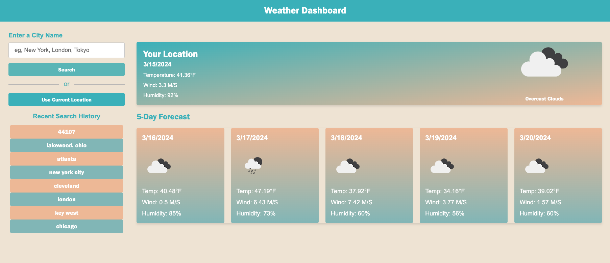

# **Server-Side APIs Challenge: Weather Dashboard**

The purpose of this project was to create a weather dashboard that shows a 5-Day forecast.

We were to build a page that lets the user seee the weather outlook for multiple cities, so that I can plan a trip accordingly.

I began by doing research and finding sources -- these videos were equally helpful in various parts of the assignment.

Sources: https://www.youtube.com/watch?v=m9OSBJaQTlM&ab_channel=PortEXE, https://www.codingnepalweb.com/weather-app-project-html-javascript/, https://home.openweathermap.org/, https://www.youtube.com/watch?v=MIYQR-Ybrn4&ab_channel=GreatStack

I followed the resources to create the Javascript, HTML, and CSS. Here are some screenshots of how my process worked. First, I grabbed colors I liked more and messed around with them for the weather palette. These were adjusted slightly as I went along to make something snazzy, but still kept the colors in a teal-palette I liked.

Next, I updated it to create HTML and CSS to make a weather site with the mentioned teals and peaches. Then, I updated the JavaScript. Here is a cool feature of making city, state and zip codes searchable as well, for ultimate accuracy.

Search by city.

Search by zip code.

Here is a cool feature of the current location button, it lets the user automatically check the weather around them.

In conclusion, I set up the quiz to meet the challenge requirements and improved it. I:
- provided a weather dashboard with form inputs
- you can search for any given city
- you can find the current and future conditions for that city, and it's added to the search history off to the left
- the user can view future weather conditions for that city in a 5-day forecast
- you can click on a city in the search history and that city is pulled up, where the user is then shown the recent city
- For extra features, the search function searchable by city, state, just by city, or by zip code
- I used localStorage for saving the recent search history

The hardest part was just working with the JavaScript and the weather API's to adjust them to how I wanted the information to look on the page, and fine-tuning the CSS.

Please follow this link to the successful, full deployed site on GitHub: https://szolton.github.io/06-challenge-week6-Interactive-Weather-Page/